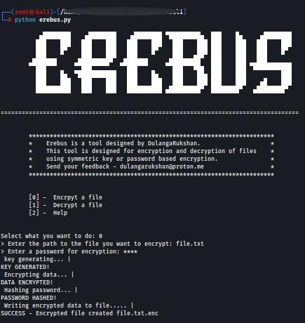

***

* * *


# **Erebus - Military Grade File Encryption = Version 1.0**

**Erebus** is an advanced encryption solution designed to protect sensitive data with military level security. Combining robust AES-256 encryption with a user friendly interface, Erebus ensures that individuals and organizations can safeguard confidential documents, financial records, and personal data against unauthorized access. Built for modern security needs, Erebus implements NIST approved algorithms while maintaining an intuitive workflow that requires no technical expertise. With enterprise grade protection, it defends against digital threats without compromising usability.

---

## **Features:**

- **AES-256 Encryption** (CBC mode with 128 bit blocks)  
  Industry leading encryption standard for maximum security.
  
- **PBKDF2HMAC-SHA256 key derivation** (100,000 iterations)  
  Strengthens the encryption key for additional protection against brute force attacks.
  
- **BCrypt password hashing** (salt+pepper protection)  
  Secure password hashing to guard against rainbow table and other password attacks.
  
- **Defense against brute force & rainbow table attacks**  
  Multi-layered defense ensuring the highest protection of sensitive data.
  
- **Cross platform compatibility** (Windows/macOS/Linux)  
  Works seamlessly across multiple operating systems.
  
- **Intuitive graphical interface** with progress tracking  
  Designed for ease of use with real-time encryption progress updates.
  
- **Secure password validation & strength checking**  
  Ensures that user passwords are strong and secure before encryption begins.

---

## **Security Highlights:**

- **FIPS 140-2 compliant cryptographic protocols**  
  Ensures compliance with government standards for data encryption.
  
- **Hardware accelerated encryption & decryption**  
  Optimized performance for faster, more efficient encryption and decryption processes.
  
- **Zero knowledge architecture** (no keys stored)  
  No encryption keys are stored, enhancing privacy and reducing the risk of key theft.
  
- **Automatic memory sanitization**  
  Memory used during encryption and decryption is automatically cleared to prevent data leakage.
  
- **Tamper evident file integrity checks**  
  Protects against file corruption and tampering.

---

## **Developed With:**

- **PyQt6** for modern GUI implementation  
- **Cryptography.io's Fernet encryption specification**  

---

## **Installation Instructions:**

### **Pre requisites:**

- Python 3.x  
- PyQt6  
- Cryptography library

---

## **Installation for GUI Version:**
---------------------------------

1.  **Clone the repository**: Open a terminal or command prompt and run:
    
    ```bash
    git clone https://github.com/Dulanga-Rukshan/Erebus.git
    ```

2.  **Navigate to the project directory**:
    
    ```bash
    cd erebus/erebusGui
    ```

3.  **Create a virtual environment** (recommended):
    
    ```bash
    python3 -m venv venv
    ```

4.  **Activate the virtual environment**:
    
    *   On **Windows**:
        
        ```bash
        venv\Scripts\activate
        ```
        
    *   On **macOS/Linux**:
        
        ```bash
        source venv/bin/activate
        ```

5.  **Install the required dependencies**:
    
    ```bash
    pip install -r requirements.txt
    ```

6.  **Run the GUI version**: Once the dependencies are installed, you can run the application:
    
    ```bash
    python erebusGui.py
    ```

7.  **Follow the prompts in the GUI** to start encrypting or decrypting files.
    

* * *

## **Installation for CLI Version:**
---------------------------------

1.  **Clone the repository**: Open a terminal or command prompt and run:
    
    ```bash
    https://github.com/Dulanga-Rukshan/Erebus.git
    ```

2.  **Navigate to the project directory**:
    
    ```bash
    cd erebus/erebusCli
    ```

3.  **Create a virtual environment** (recommended):
    
    ```bash
    python3 -m venv venv
    ```

4.  **Activate the virtual environment**:
    
    *   On **Windows**:
        
        ```bash
        venv\Scripts\activate
        ```
        
    *   On **macOS/Linux**:
        
        ```bash
        source venv/bin/activate
        ```

5.  **Install the required dependencies**:
    
    ```bash
    pip install -r requirements.txt
    ```

6.  **Run the CLI version**: Once the dependencies are installed, you can run the application:
    
    ```bash
    python cli_version.py
    ```

7.  **Follow the prompts in the terminal** to encrypt or decrypt files.
    

* * *

## **Usage:**
----------

- **GUI Version:**  
    The GUI version provides an intuitive interface. After running the program, simply click to encrypt or decrypt files. You will be guided through a visual step by step process.
    
- **CLI Version:**  
    For the command line version, follow the on screen prompts to select encryption or decryption tasks. Enter the required file path and password when prompted.
    

* * *

## **Important Notes:**
--------------------

- **Always maintain backup copies of your files and remember your passwords** – forget password files cannot be recovered.
- Erebus is intended for **personal and enterprise use** to secure sensitive data.
- **Do not share your password** with anyone to ensure your data remains private.


* * *

## **License:**
------------

This software is licensed under the MIT License. See the **LICENSE** file for more information.

* * *

## **Developed by:**
-----------------

**Dulanga Rukshan**


* * *


**CLI screenshots**
**Image 01**

* * *
**Image 02**

* * *
**Image 03**


* * *

**GUI screenshots**
**Image 01**

* * *
**Image 02**

* * *
**Image 03**

* * *
**Image 04**

* * *
**Image 05**

* * *
**Image 06**

* * *
**Image 07**

* * *
**Image 08**

* * *
**Image 09**

* * *
**Image 10**

* * *
**Image 11**

* * *
**Image 12**

* * *
**Image 13**


